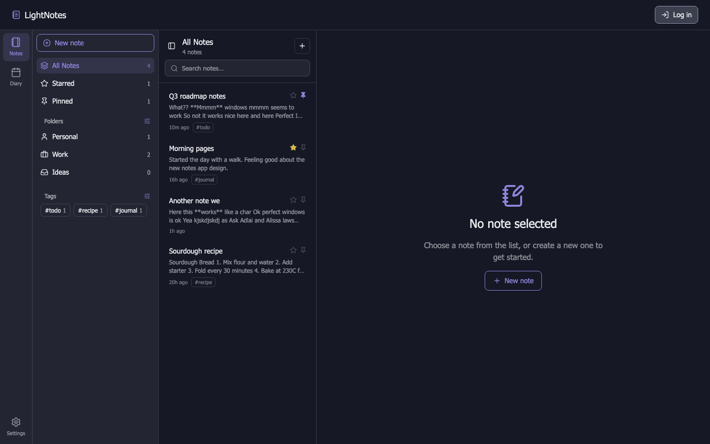
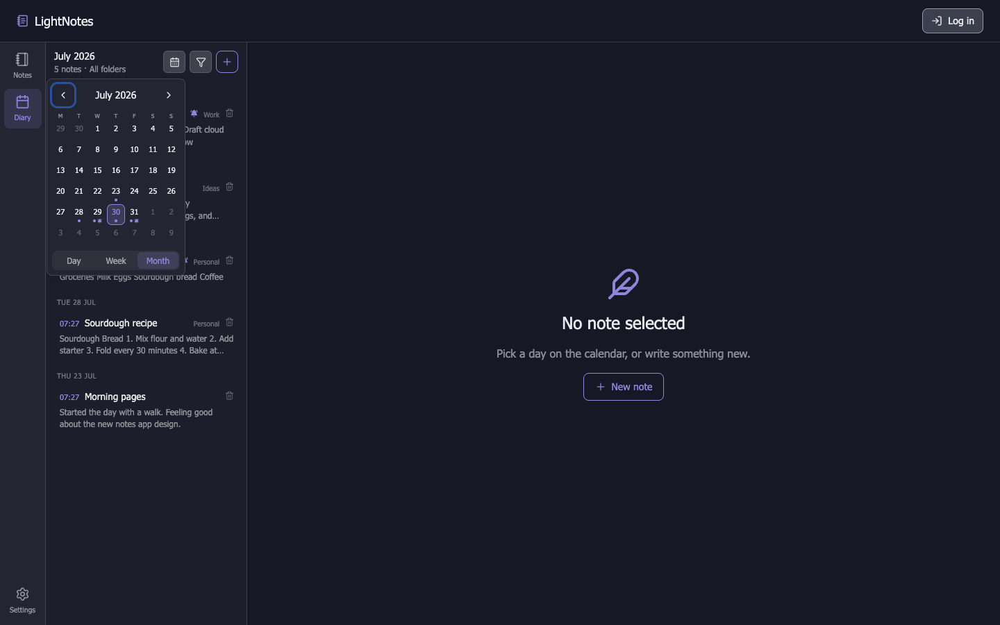
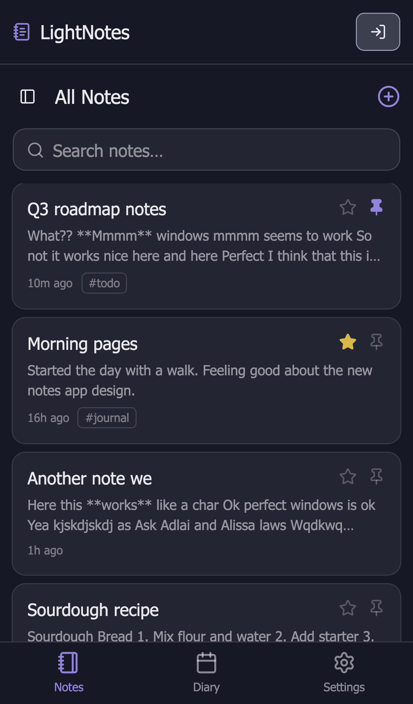
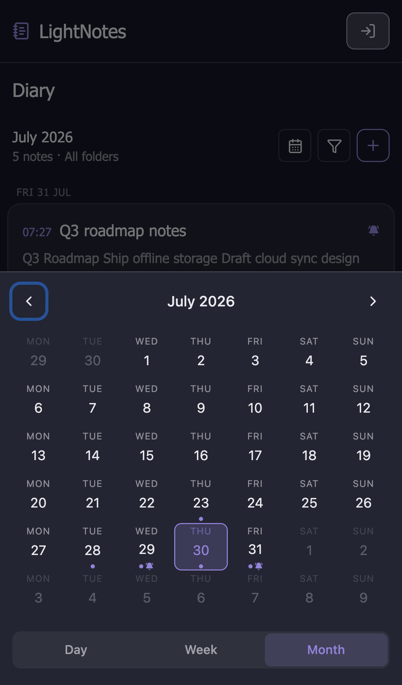
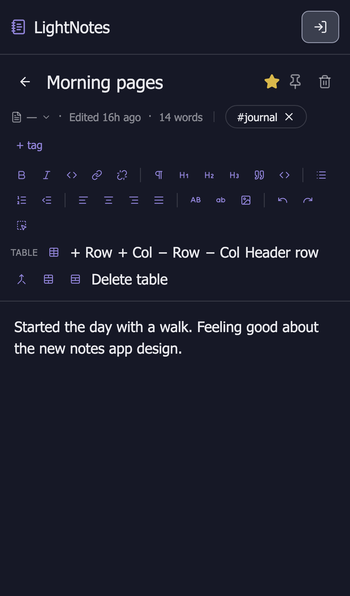
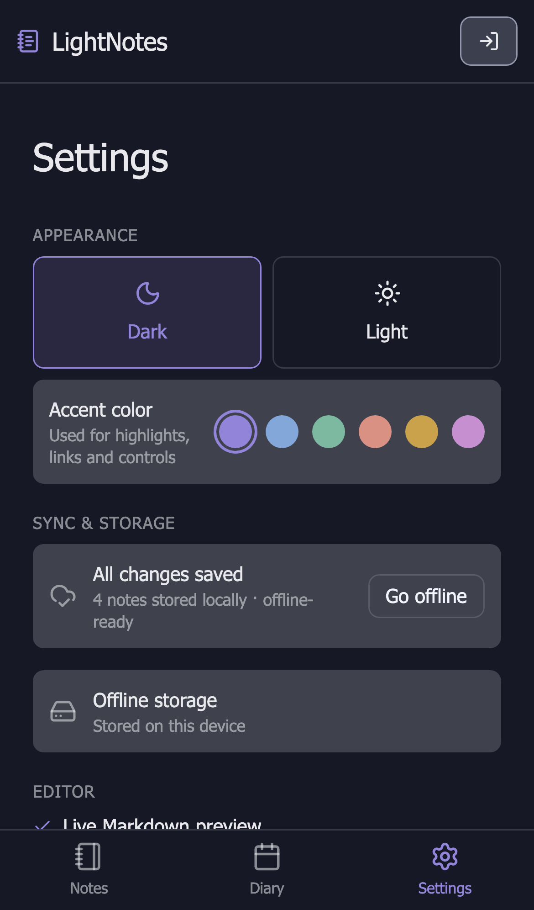
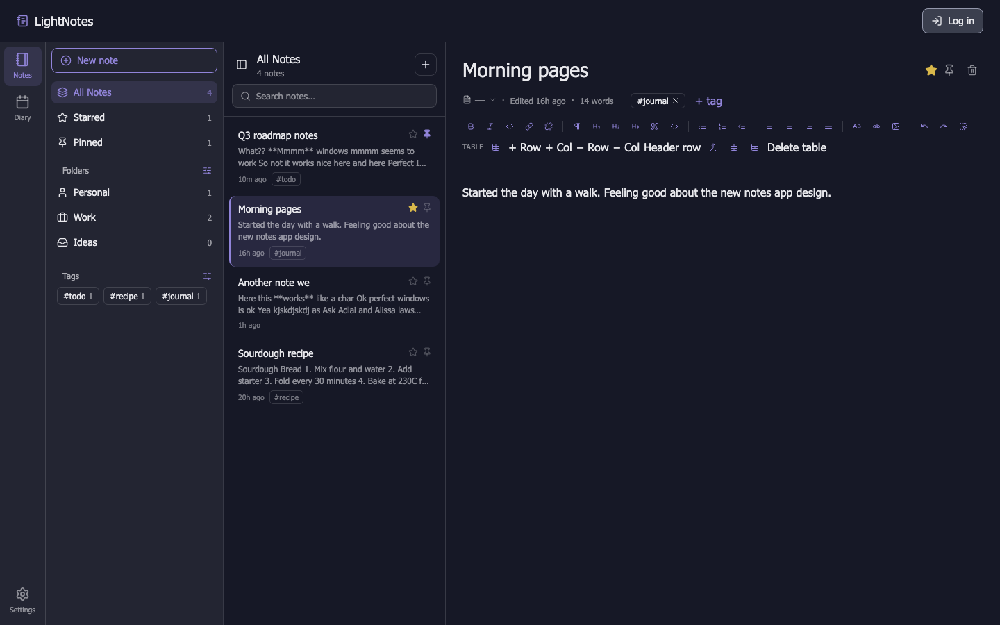
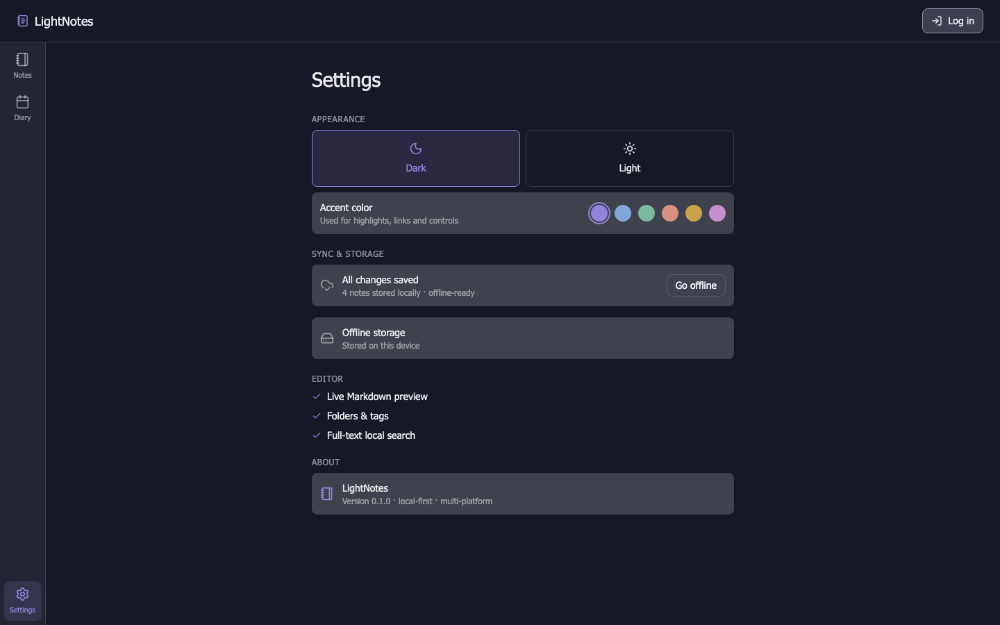
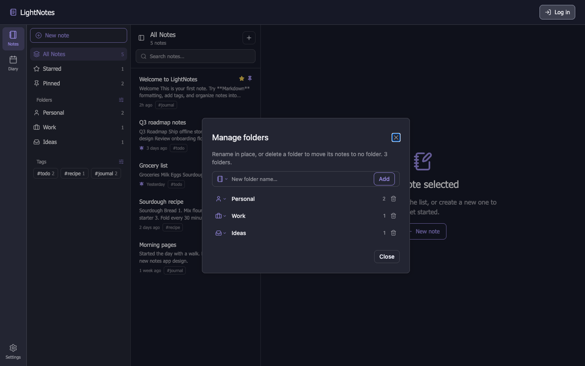

# LightNotes

A local-first notes app built with [Dioxus 0.7](https://dioxuslabs.com/) — one Rust codebase shipping to web, desktop, and mobile, with a rich Markdown editor, folders & tags, and background sync to a self-hosted API.

LightNotes is intended to be self-hosted: you run the `api` backend yourself alongside the client apps. A hosted cloud version is currently in development.


<p align="center">
  
</p>

<p align="center">
  
</p>

<p align="center">
  
  
  
  
</p>

## Features

**Notes & organization**
- Create, star, pin, and delete notes — pinned notes always float to the top of the list.
- Organize notes into icon-tagged folders and freeform hashtags, with dedicated "Manage folders" / "Manage tags" dialogs for renaming and cleanup.
- Filter by All / Starred / Pinned / a specific folder / a specific tag, with live note counts.
- Instant, local full-text search across titles and content.

**Diary**
- A calendar-based view over the same notes — every note can carry its own date, independent of when it was created or last edited.
- Day / Week / Month calendar with dots marking days that have notes and a bell glyph on days with a reminder set.
- Filter the diary's entry list by folder or tag, same as the Notes tab.
- Set an optional reminder ("at the time" up to a week before) on any note; a bell icon marks reminders in both the Diary and Notes lists.

**Rich Markdown editor**
- WYSIWYG editing that round-trips cleanly to Markdown — no "preview mode" required.
- Full formatting toolbar: bold/italic/code, headings, blockquotes, code blocks, ordered/unordered lists, alignment, case transforms, undo/redo.
- Inline links (with an edit dialog), image embeds, and resizable tables with row/column/header controls.

**Appearance**
- Dark and light themes, with 6 selectable accent colors used across highlights, links, and controls.

**Offline-first sync**
- Every note, folder, and tag is persisted on-device (SQLite on native, a local store on web) so the app works fully offline.
- On native platforms that database is encrypted at rest with SQLCipher, under a random 256-bit key held in the OS keychain (Keychain on macOS/iOS, Credential Manager on Windows, Secret Service on Linux, app-private storage on Android). Notes, the pending-sync queue, and the stored auth tokens are all covered. Sync itself is *not* end-to-end encrypted — the server can read note content.
- A background sync engine reconciles local changes against a self-hosted Rust API over REST + Server-Sent Events, with debounced batching, exponential-backoff reconnects, and last-write-wins conflict resolution.
- A manual "Go offline / Go online" toggle in Settings lets you simulate connectivity loss.

**One codebase, every platform**
- Shared routing, views, and components live in `packages/app`; each of `apps/web`, `apps/desktop`, and `apps/mobile` is a thin platform shell around it.
- The layout adapts per platform: a persistent sidebar + top bar on desktop, a compact header with bottom tab navigation on mobile.

<details>
<summary>More screenshots</summary>
<br>

| Note editor (desktop) | Settings (desktop) | Manage folders (desktop) |
| --- | --- | --- |
|  |  |  |

</details>

## Project structure

This is a Cargo workspace. Platform apps are thin binaries; shared logic lives in `packages/`.

```
notes/
├─ apps/
│  ├─ landing/   # Marketing/landing site (web + server)
│  ├─ web/       # Notes app — web platform shell
│  ├─ desktop/   # Notes app — desktop platform shell
│  ├─ mobile/    # Notes app — Android/iOS platform shell
│  └─ api/       # Rust (axum) backend: REST + SSE sync API over MongoDB
└─ packages/
   ├─ app/        # Shared routes, views, and app-specific components (used by web/desktop/mobile)
   ├─ ui/         # Generic, app-agnostic presentational components
   ├─ editor/     # The rich-text/Markdown editor engine used by the note editor
   ├─ store-sdk/  # Local, on-device persistence (SQLCipher-encrypted SQLite / web storage)
   ├─ sync-dto/   # Shared data-transfer types for the client/server sync contract
   └─ api-sdk/    # Typed client for calling the api crate's endpoints
```

## Getting started

### Prerequisites

- [Rust](https://www.rust-lang.org/tools/install) (stable)
- The [Dioxus CLI](https://dioxuslabs.com/learn/0.7/getting_started): `cargo install dioxus-cli`
- [Docker](https://www.docker.com/) (only needed to run the API's MongoDB dependency)

Copy the example environment file and adjust ports/credentials if needed:

```bash
cp .env.dist .env
```

### Running the apps

Each target has a `make` shortcut (see the [`Makefile`](Makefile)); the equivalent raw `dx`/`cargo` command is shown alongside it.

| Target | Command | Notes |
| --- | --- | --- |
| Landing site | `make landing-dev` | `dx serve --package landing --platform web --port $(LANDING_PORT)` |
| Notes app — web | `make app-web-dev` | `dx serve --package web --platform web --port $(APP_WEB_PORT)` |
| Notes app — desktop | `make app-desktop-dev` | `dx serve --package desktop --platform desktop` |
| Notes app — Android | `make app-android-dev` | `dx serve --package light-notes-mobile --platform android` (needs an emulator/device) |
| Notes app — iOS | `make app-ios-dev` | `dx serve --package light-notes-mobile --platform ios` (needs a simulator/device, macOS only) |
| Backend API | `make api-dev` | `cargo run -p api` |

The backend API needs MongoDB. Start it (and the mongo-express admin UI) with Docker Compose:

```bash
make docker-up    # starts MongoDB + mongo-express
make api-dev      # starts the sync API on $(API_PORT)
make docker-down  # stop the containers when you're done
```

The web, desktop, and mobile apps work fully offline without the API running — sync simply resumes once it's reachable.

### Building for release

| Target | Command |
| --- | --- |
| Landing site | `make landing-build` |
| Notes app — web | `make app-web-build` |
| Notes app — desktop | `make app-desktop-build` |
| Notes app — Android | `make app-android-build` |
| Notes app — iOS | `make app-ios-build` |
| Backend API | `make api-build` |

### Releasing the desktop apps

Desktop releases are cut by pushing a tag. One tag produces **one** GitHub Release carrying the artifacts for every platform — there are no platform-only releases.

```bash
# 1. bump the version in apps/desktop/Cargo.toml, commit, merge to main
# 2. tag it
git tag v1.2.3
git push origin v1.2.3
```

That triggers `.github/workflows/release-desktop.yml`, which:

1. resolves the version from the tag and **fails if it disagrees with `apps/desktop/Cargo.toml`**,
2. fans out to the macOS, Windows and Linux workflows in parallel,
3. collects every artifact, writes `SHA256SUMS`, and publishes a single **draft** release with notes generated from the commits since the previous release.

The release job declares `needs: [macos, windows, linux]`, so **if any platform fails, nothing is published** — a half-built release can never reach users. The release is created as a draft: review the artifacts, then hit Publish. Tags with a prerelease suffix (`v1.2.3-rc.1`, `v1.2.3-beta.2`) are additionally marked as prereleases.

The tag is the source of truth for the artifact filenames, but the *bundlers* stamp the version from `apps/desktop/Cargo.toml` into the binaries themselves — a `.dmg` named `1.2.3` whose `Info.plist` says `0.1.0` would be worse than a failed build, which is why the mismatch is a hard error rather than a warning.

Expected release contents:

```
LightNotes-1.2.3-macos-aarch64.dmg
LightNotes-1.2.3-macos-x86_64.dmg
LightNotes-1.2.3-windows-x86_64.msi
LightNotes-1.2.3-windows-x86_64-setup.exe
LightNotes-1.2.3-linux-x86_64.AppImage
LightNotes-1.2.3-linux-x86_64.deb
LightNotes-1.2.3-linux-x86_64.rpm
SHA256SUMS
```

Running the workflow via **workflow_dispatch** is a dry run: it builds all three platforms and uploads the artifacts to the run, but publishes no release. Use it to check a platform after changing its workflow.

The `version`, `linux` and `release` jobs all run on the `[self-hosted, homelab]` runner. macOS and Windows use GitHub-hosted runners, since the self-hosted one is Linux X64.

That runner is itself a Docker container, defined in `/opt/gh-runner-docker` on the runner host and built from `ubuntu:22.04` with the WebKitGTK build dependencies baked in. Two consequences worth knowing:

- The **glibc floor is pinned by the runner image**, not by a `container:` block in a workflow. The host is Debian 12 (glibc 2.36); the runner image is Ubuntu 22.04 (glibc 2.35), which is what we actually ship against.
- Every job runs as the same unprivileged user inside that container. An earlier arrangement — a `container:` block on a host-installed runner — left `root`-owned files in the shared workspace that later host-level jobs could not clean, failing `actions/checkout` with `EACCES`. Running the runner itself in the container removes that class of problem rather than working around it.

Per-platform details — signing secrets, WebView2, the glibc floor — are in [`apps/desktop/README.md`](apps/desktop/README.md).

## Styling

Each platform app scans its own `src/` plus the shared `packages/app` and `packages/ui` sources for Tailwind classes — `dx serve`/`dx build` compile this automatically, no separate Node/npm step required.

## License

MIT — see [LICENSE](LICENSE).
